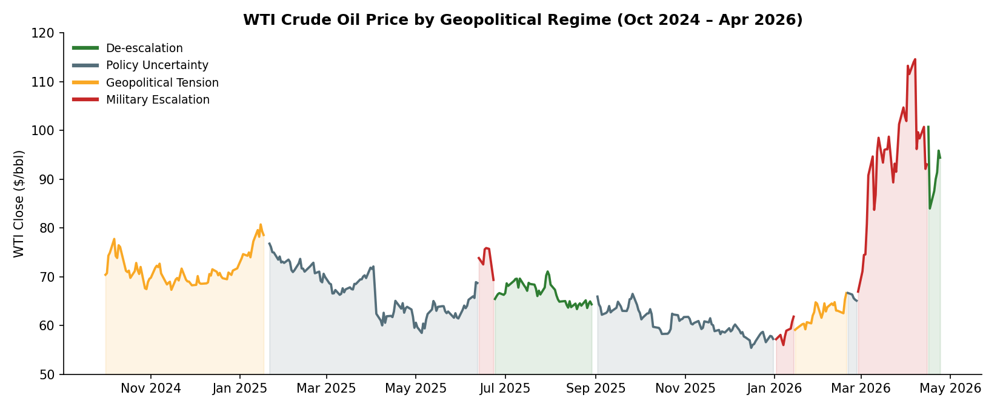
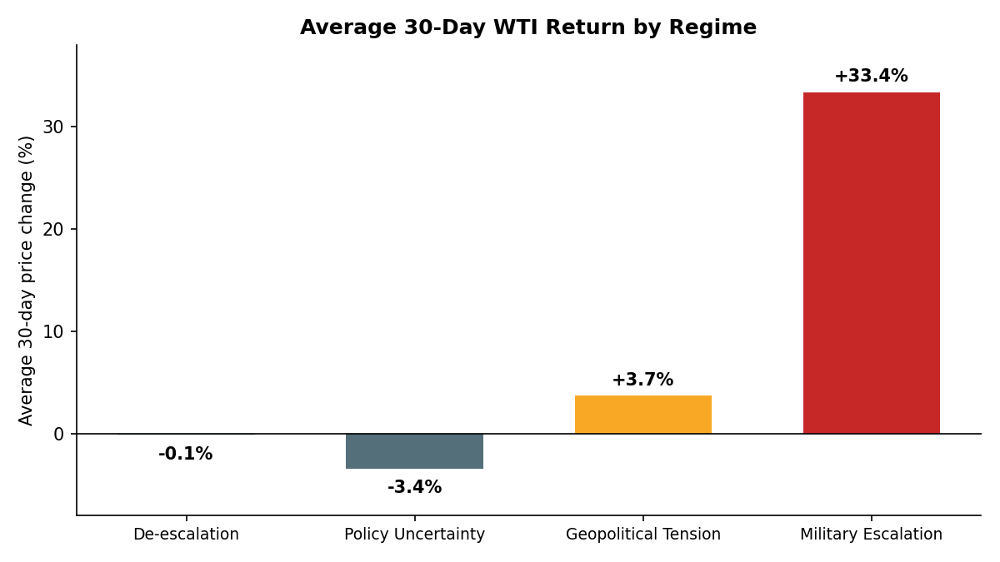
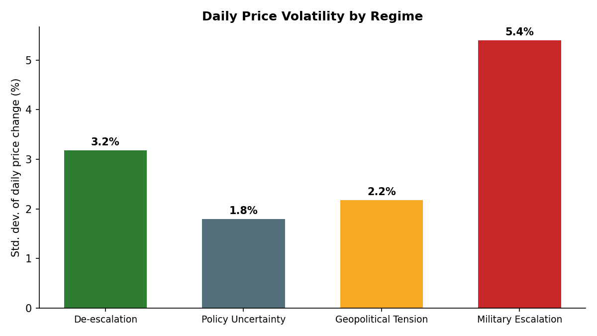

# WTI Crude Oil Geopolitical Risk Analysis

**How do different categories of geopolitical events affect WTI crude oil prices over short- and medium-term horizons?**

This project categorizes 389 trading days of WTI crude oil prices (October 2024 – April 2026, sourced from [FRED](https://fred.stlouisfed.org/)) into four geopolitical regimes and measures how price behavior — both returns and volatility — differs across them. The original analysis was built in Excel (pivot tables, frequency distributions, descriptive statistics); a companion Python script independently reproduces the headline statistics.



## The four regimes

Each trading day was classified by the dominant geopolitical backdrop influencing the oil market, anchored to researched trigger events:

| Regime | Days | Description |
|---|---|---|
| Policy Uncertainty | 188 | Unclear policy direction (tariffs, sanctions policy, administration changes) |
| Geopolitical Tension | 97 | Elevated risk without active conflict escalation |
| De-escalation | 55 | Diplomatic progress, cease-fires, cooling tensions |
| Military Escalation | 49 | Active conflict escalation affecting supply risk |

## Key findings

**1. Military escalation produces dramatically higher returns — and volatility.**

WTI rose an average of **+33.4% over 30 trading days** during Military Escalation regimes, versus **−3.4%** during Policy Uncertainty.



**2. The volatility gap is statistically unambiguous.**

Daily price volatility during Military Escalation (σ = 5.4%) was roughly **3x** that of Policy Uncertainty (σ = 1.8%), with **61% of escalation days moving more than 2%** in either direction. A Levene test confirms the variance difference is highly significant (W = 55.7, **p < 0.0001**). Notably, a Welch t-test on *mean* daily returns is not significant (p = 0.14) — the regime signal lives in the volatility and in multi-day cumulative returns, not in any single day's average move.



**3. The findings translate into regime-based strategy recommendations.**

- **Military escalation:** prices spike sharply and consistently — increase hedging and secure fuel contracts early.
- **De-escalation:** most stable regime (lowest price dispersion, bulk of days trading in the $60–65 range) — delay major purchases while prices settle.
- **Geopolitical tension:** moderate upward drift (+3.7% over 30 days) — staggered procurement preserves flexibility.
- **Policy uncertainty:** mixed, mildly negative signal — balanced hedging and close monitoring.

## Repository structure

```
├── analysis/    Excel workbook (pivot tables, frequency distributions, summary stats)
├── charts/      Figures generated from the raw data
├── data/        Daily WTI closes with regime labels and 1/3/7/30-day % changes (CSV)
├── report/      Full written report (background, methodology, limitations, recommendations)
└── scripts/     Python replication of the headline statistics
```

## Reproducing the results

```bash
pip install pandas scipy
python scripts/replicate_analysis.py
```

The script recomputes the per-regime return averages, volatility comparison, Levene variance test, and Welch t-test directly from `data/wti_daily_prices.csv`.

## Methodology & limitations

Percent changes are measured in *trading days* (markets close on weekends), so "30-day" means 30 observations prior. Regime classification is based on qualitative judgment of trigger events, so boundaries involve some subjectivity, and overlapping regimes were excluded. Oil prices are influenced by many factors beyond geopolitics (production decisions, macro conditions, currency moves), so observed differences cannot be attributed exclusively to geopolitical events. Full discussion in the [written report](report/WTI_Geopolitical_Risk_Report.pdf).

*This is an academic analysis, not investment advice.*
